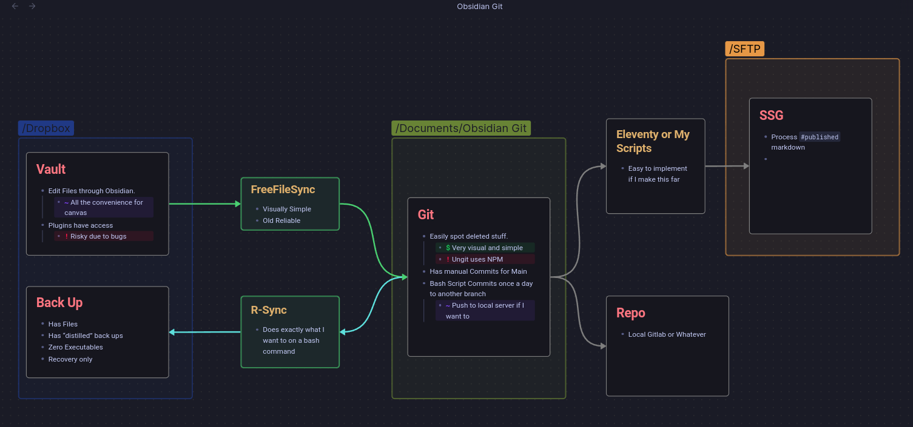

# Periodic Git

This is a bash script that uses git and rsync to back up files.
1. Git will access a "daily" branch and if there are changes, it will throw them in there. It will not alter other branches.
2. If given a second path, it will rsync the folder to that path.

## Why I made this

This script is a huge reminder of "I should have just used python". It took me triple the time and highlighted the reasons I hate myself more than months of theraphy.

It is also somewhat of a niche use case:

1. I am afraid of disk errors or Obsidian plugin bugs messing with my files.
2. I am terrible at git (use this plugin at your own risk), I don't want it in my actual vault.
3. I need visual control (ungit) showing me the changes when I want to if nº 1 happens, but I don't want nº 2 to automatically alter my vault.
4. I want a third copy of my work having zero executables. Around.
5. I wanted to future proof my pipeline for my other vaults




## How do I use this

### Requirements

If you are using linux chances are you already have those out of the box:

- Bash
- Rsync
- Git

As far as configurations go:

- Make the "daily" branch yourself.
- Crontab it (there is a copy paste bellow)

## Install

You can throw this on your scripts and just use the path on your auto start:

`<path>/periodic.sh`

If your distro sucks at kickstarting scripts, I suggest you download [Ignition](https://flathub.org/apps/io.github.flattool.Ignition).

The _correct_ way to schedule this would be using a cron job.

```
0 0 * * * <path>/periodic.sh <parameters>

```

## Use

This bash script is very simple:

```
./per_git <input_path> 
```

This will check if the path exist, check if the branch exist, and make a commit.

**IT WILL NOT PUSH IT**. If you want it pushed to your repo, uncomment the line on the code that does that.

```
./per_git <input_path> <output_path>
```

This will check if both paths exist, check if the branch exist, and after the commit it will run a simple rsync to the path.

If you're having any problems with path, use `$HOME/`on the input, gives less headaches (usually)

On both cases, it will log what it did on `.PERIODIC.log`, which _somehow_ was the hardest part to do.

It is commented so future me can have an idea if he is ever stupid enough to do it in bash again. It also has a already a check for a third input, in my case it was for a return I'm not needing at the moment. If you need to do something with that, just fork it and play with the end of the code.


